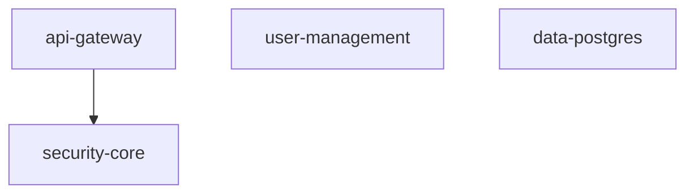

# Module catalog

The module catalog (`adapters/acme-vue-encore/modules/`) contains composable service modules that the generator can merge into a generated application at create time. Each module declares its composition through a `manifest.json` validated against the schema in `scripts/lib/manifest.schema.ts`.

## Available modules

| Module | Version | Status | Description |
|--------|---------|--------|-------------|
| `security-core` | 2.0.0 | stable | Cross-cutting security configuration. Documents the CORS origin knob the base app's `encore.app` global_cors consumes. |
| `api-gateway` | 2.0.0 | stable | BFF API gateway opt-in. Documents private-backend config knobs and contributes the frontend `/connectivity` test page. |
| `data-postgres` | 2.0.0 | stable | Declarative marker that PostgreSQL persistence is built into the base via Encore's `SQLDatabase("app")`. |
| `user-management` | 2.0.0 | stable | Application-side user + role management as an Encore service. The reference shape for feature modules. |

## Module taxonomy

Modules fall into two categories:

### Cross-cutting modules (declarative only)

These modules ship no `apps/api/src/**` payload. They are declarative markers documenting configuration knobs already present in the base app:

- **security-core**: CORS origin configuration (`CORS_ORIGIN` env var).
- **api-gateway**: BFF proxy configuration (OAuth client secrets already declared by the base).
- **data-postgres**: PostgreSQL via Encore's `SQLDatabase("app")`.

### Service modules (files + declarations)

These modules ship an Encore service directory under `files/` and declare services, migrations, secrets, and other composition payloads:

- **user-management**: ships the `user-management` Encore service with role catalog tables, admin CRUD endpoints, and middleware declarations.

## Manifest schema

Every module manifest declares:

| Field | Type | Purpose |
|-------|------|---------|
| `name` | string | Module identifier (matches directory name). |
| `version` | string | Semver version. |
| `description` | string | Human-readable description. |
| `status` | string | `stable`, `beta`, or `deprecated`. |
| `requires` | string[] | Hard dependencies (auto-installed). |
| `requiresOneOf` | string[] | At least one must be present. |
| `optionalPeers` | string[] | Enhanced behavior when present. |
| `conflicts` | string[] | Cannot coexist (auto-removed on install). |
| `services` | string[] | Encore services contributed. |
| `secrets` | object[] | Encore secrets to bind. |
| `corsEntries` | string[] | CORS origins to merge. |
| `middlewares` | string[] | Middleware references. |
| `migrations` | object[] | Database migrations to merge. |
| `files` | object | Source-to-destination file map. |
| `authExports` | string[] | Auth-related exports. |
| `webSnippetFile` | string | Frontend registration snippet. |
| `packageDeps` | object | npm dependencies to merge. |
| `envVars` | object | Environment variables to declare. |

## user-management: the reference module

The `user-management` module is the reference implementation for service modules (spec 003). It demonstrates:

- An Encore service directory (`files/apps/api/user-management/`) with typed endpoints behind auth + `requireRole`.
- A database migration (`db/1_user_management.up.sql`) creating the `app_role` catalog and `user_role` assignments.
- Middleware declarations (`securityHeaders`, `csrfMiddleware`, `apiRateLimit`).
- A web snippet for frontend navigation registration.

## Dependency graph

Only `api-gateway` declares a hard dependency (`requires: ["security-core"]`). All other modules are independent.
